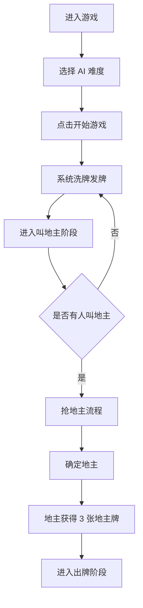
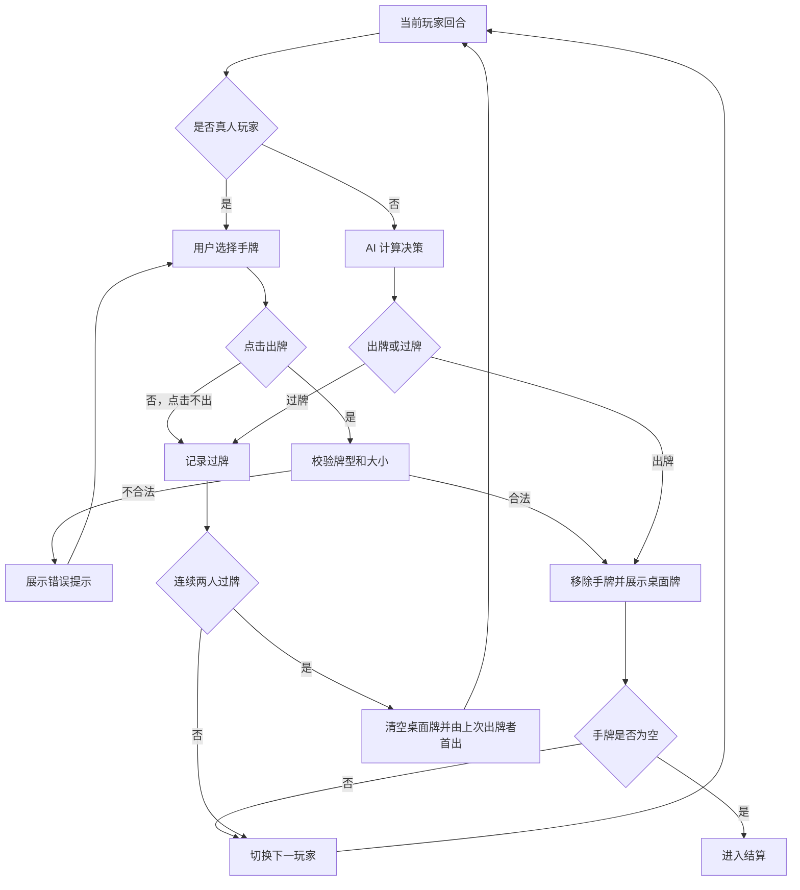
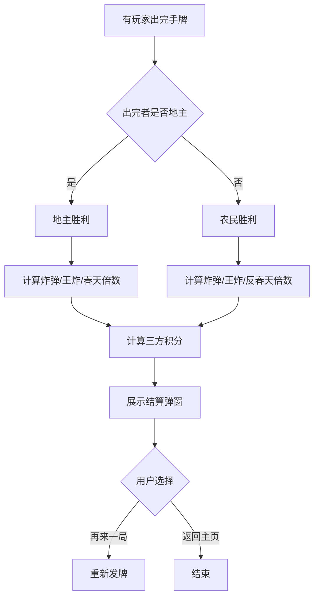

# 斗地主游戏 PRD（产品需求文档）

---

## 1. 文档概述

### 1.1 文档信息

| 项目 | 内容 |
|------|------|
| 文档名称 | 斗地主游戏产品需求文档 |
| 文档版本 | v1.0 |
| 创建日期 | 2026-04-28 |
| 文档状态 | 草稿 |
| 目标受众 | 产品、设计、前端、后端、测试、项目负责人 |

### 1.2 修订历史

| 版本 | 日期 | 修订人 | 修订内容 |
|------|------|--------|----------|
| v1.0 | 2026-04-28 | - | 初始版本创建 |

### 1.3 项目背景

斗地主是国内用户认知度高、规则成熟、节奏较快的纸牌游戏。项目目标是开发一款支持玩家与电脑对战的斗地主游戏，让用户可以在浏览器或移动端随时开始一局单机对战，获得稳定、清晰、低门槛的娱乐体验。

**项目特点：**
- 支持 1 名真人玩家与 2 名电脑玩家对战。
- 完整实现经典三人斗地主核心规则。
- 提供不同难度电脑 AI，满足新手和休闲玩家需求。
- 支持断线/刷新后的本地对局恢复，降低中断成本。

---

## 2. 产品概述

### 2.1 产品定位

一款轻量级斗地主游戏，面向休闲玩家提供开箱即玩的单机人机对战体验。

### 2.2 目标用户

| 用户角色 | 人数/规模 | 主要诉求 |
|----------|----------|----------|
| 休闲玩家 | 大众用户 | 快速开始游戏，打发碎片时间 |
| 斗地主新手 | 入门用户 | 通过提示和低难度 AI 熟悉规则 |
| 进阶玩家 | 中高频用户 | 选择更高难度电脑，获得更有挑战的对局 |
| 测试/运营人员 | 内部用户 | 验证规则、AI、计分和异常场景 |

### 2.3 核心价值

1. **即开即玩**：无需注册即可进入单机人机对战。
2. **规则完整**：覆盖发牌、叫地主、抢地主、出牌、压牌、过牌、炸弹、春天、结算等核心规则。
3. **AI 可控**：通过难度配置调整电脑出牌策略，兼顾新手友好和对战挑战。
4. **体验清晰**：通过牌型识别、可出牌提示、倒计时和出牌记录降低用户理解成本。

---

## 3. 角色与权限体系

### 3.1 角色定义

#### 3.1.1 真人玩家

用户实际操作的玩家席位。默认位于屏幕底部，负责叫地主、抢地主、选择手牌、出牌、过牌、查看结算、重新开始。

#### 3.1.2 电脑玩家

系统控制的两个 AI 席位。根据难度、当前身份、手牌、桌面牌型和剩余牌数自动执行叫分、抢地主、出牌和过牌。

#### 3.1.3 系统裁判

游戏规则引擎。负责洗牌、发牌、地主牌分配、牌型识别、合法性校验、回合流转、胜负判定和结算。

### 3.2 权限矩阵

| 功能模块 | 真人玩家 | 电脑玩家 | 系统裁判 |
|----------|:--------:|:--------:|:--------:|
| 开始新局 | ✓ | ✗ | ✓ |
| 洗牌发牌 | ✗ | ✗ | ✓ |
| 叫地主/抢地主 | ✓ | ✓ | ✓ |
| 选择手牌 | ✓ | ✗ | ✗ |
| 自动决策 | ✗ | ✓ | ✗ |
| 出牌/过牌 | ✓ | ✓ | ✓ |
| 牌型校验 | ✗ | ✗ | ✓ |
| 胜负判定 | ✗ | ✗ | ✓ |
| 积分结算 | ✗ | ✗ | ✓ |
| 查看记录 | ✓ | ✗ | ✓ |

> ✓：有权限或执行职责；✗：无权限或不负责。

---

## 4. 功能需求

### 4.1 P0：核心功能（MVP）

#### 4.1.1 游戏初始化

| 功能编号 | 功能名称 | 功能描述 | 验收标准 |
|----------|----------|----------|----------|
| F001 | 新建对局 | 用户点击“开始游戏”后创建三人斗地主对局 | 生成 3 个玩家席位，完成洗牌和发牌 |
| F002 | 洗牌发牌 | 使用一副 54 张牌，随机洗牌后每人 17 张，保留 3 张地主牌 | 三名玩家手牌合计 51 张，地主牌 3 张，无重复牌 |
| F003 | 玩家座位 | 真人玩家固定在底部，两个电脑玩家位于左侧和右侧 | 页面清楚展示三方身份、昵称和剩余牌数 |
| F004 | 难度选择 | 支持简单、普通、困难三档电脑难度 | 开局前可选择难度，默认普通 |

#### 4.1.2 叫地主与抢地主

| 功能编号 | 功能名称 | 功能描述 | 验收标准 |
|----------|----------|----------|----------|
| F011 | 叫地主 | 支持“叫地主/不叫”流程 | 用户和电脑均可完成叫地主决策 |
| F012 | 抢地主 | 有玩家叫地主后，其他玩家可选择“抢地主/不抢” | 抢地主流程结束后确定地主身份 |
| F013 | 地主牌展示 | 地主确定后翻开 3 张地主牌，并加入地主手牌 | 地主手牌变为 20 张，农民手牌保持 17 张 |
| F014 | 重新发牌 | 若所有玩家均不叫地主，自动重新洗牌发牌 | 不进入出牌阶段，重新开始叫地主流程 |

#### 4.1.3 出牌规则

| 功能编号 | 功能名称 | 功能描述 | 验收标准 |
|----------|----------|----------|----------|
| F021 | 手牌选择 | 真人玩家可点击手牌进行选中/取消选中 | 选中牌有明显上移或高亮状态 |
| F022 | 牌型识别 | 系统识别单张、对子、三张、三带一、三带二、顺子、连对、飞机、四带二、炸弹、王炸等牌型 | 合法牌型识别准确，不合法组合提示错误 |
| F023 | 出牌校验 | 用户出牌必须符合牌型规则，并能压过桌面当前牌型 | 不合法出牌不能提交，并显示原因 |
| F024 | 过牌 | 当前轮可过牌时，用户可选择“不出” | 新一轮首出玩家不能过牌 |
| F025 | 自动轮转 | 玩家完成出牌或过牌后，自动进入下一位玩家回合 | 回合顺序保持逆时针或顺时针一致，不能跳人 |
| F026 | 牌局清空 | 连续两名玩家过牌后，桌面牌清空，上一位出牌者获得新一轮首出权 | 新一轮可出任意合法牌型 |

#### 4.1.4 电脑 AI

| 功能编号 | 功能名称 | 功能描述 | 验收标准 |
|----------|----------|----------|----------|
| F031 | AI 叫地主 | 电脑根据手牌强度决定是否叫地主或抢地主 | 强牌更倾向叫地主，弱牌更倾向不叫 |
| F032 | AI 出牌 | 电脑在自己的回合自动选择出牌或过牌 | 决策结果必须合法，响应时间不超过 2 秒 |
| F033 | AI 难度 | 简单、普通、困难三档采用不同策略强度 | 简单偶尔保守或随机，困难优先考虑牌型拆分和剩余牌数 |
| F034 | AI 思考表现 | 电脑出牌前展示短暂“思考中”状态 | 用户能感知当前轮到电脑操作 |

#### 4.1.5 胜负判定与结算

| 功能编号 | 功能名称 | 功能描述 | 验收标准 |
|----------|----------|----------|----------|
| F041 | 胜负判定 | 任意玩家手牌出完时结束对局 | 地主先出完则地主胜，任一农民先出完则农民胜 |
| F042 | 基础倍数 | 支持底分、叫抢倍数、炸弹倍数、王炸倍数 | 每出现一次炸弹或王炸，倍数翻倍 |
| F043 | 春天判定 | 支持春天和反春天结算 | 符合条件时倍数翻倍 |
| F044 | 积分结算 | 按地主输赢计算三方积分变化 | 地主输赢两份，农民各输赢一份 |
| F045 | 结算弹窗 | 对局结束后展示胜负、倍数、得分、关键数据 | 用户可选择再来一局或返回主页 |

#### 4.1.6 基础界面

| 功能编号 | 功能名称 | 功能描述 | 验收标准 |
|----------|----------|----------|----------|
| F051 | 主游戏桌 | 展示三方玩家、桌面牌、地主牌、当前倍数和操作区 | 首屏信息完整，无关键操作被遮挡 |
| F052 | 操作按钮 | 根据当前阶段展示叫地主、抢地主、出牌、不出、提示、重开等按钮 | 非当前玩家或不可用操作按钮置灰 |
| F053 | 出牌记录 | 记录每轮玩家出的牌或过牌 | 用户可查看最近出牌历史 |
| F054 | 剩余牌数 | 展示每位玩家剩余手牌数量 | 每次出牌后实时更新 |
| F055 | 状态提示 | 展示当前阶段和当前行动玩家 | 用户能明确知道当前该谁操作 |

### 4.2 P1：重要功能

| 功能编号 | 功能名称 | 功能描述 | 验收标准 |
|----------|----------|----------|----------|
| F101 | 出牌提示 | 系统为真人玩家推荐可出的牌 | 点击“提示”后选中一组合法且能压过当前牌的手牌 |
| F102 | 自动托管 | 用户超时未操作时自动执行出牌或过牌 | 超时后系统自动决策，用户可取消托管 |
| F103 | 倒计时 | 叫地主、抢地主、出牌阶段显示操作倒计时 | 倒计时结束触发默认行为 |
| F104 | 本地存档 | 对局状态保存到本地，刷新后可恢复 | 刷新页面后可继续未结束对局 |
| F105 | 音效反馈 | 支持发牌、出牌、过牌、炸弹、胜负音效 | 用户可开启或关闭音效 |
| F106 | 牌面主题 | 支持至少 2 套牌面和桌面主题 | 设置后即时生效或下局生效 |
| F107 | 新手辅助 | 展示牌型名称、错误原因和可出规则提示 | 新手能理解为什么不能出牌 |

### 4.3 P2：增强功能（后续迭代）

| 功能编号 | 功能名称 | 功能描述 |
|----------|----------|----------|
| F201 | 战绩统计 | 统计胜率、局数、最高倍数、累计积分 |
| F202 | 成就系统 | 设置连胜、炸弹、春天等成就 |
| F203 | 回放功能 | 支持查看上一局完整出牌过程 |
| F204 | 自定义规则 | 支持配置是否允许四带二、是否启用抢地主、初始底分等 |
| F205 | 多人联机 | 后续扩展真人联网对战 |
| F206 | 排行榜 | 基于本地或账号积分展示排行 |

---

## 5. 规则需求

### 5.1 牌面与大小

| 类别 | 规则 |
|------|------|
| 牌数 | 使用一副 54 张牌，包括 52 张普通牌和大小王 |
| 点数顺序 | 3 < 4 < 5 < 6 < 7 < 8 < 9 < 10 < J < Q < K < A < 2 < 小王 < 大王 |
| 花色 | 花色不影响大小，仅用于展示 |
| 地主牌 | 每局保留 3 张，地主确定后加入地主手牌 |

### 5.2 支持牌型

| 牌型 | 示例 | 规则说明 |
|------|------|----------|
| 单张 | 7 | 任意一张牌 |
| 对子 | 88 | 两张点数相同的牌 |
| 三张 | 999 | 三张点数相同的牌 |
| 三带一 | 999 + 4 | 三张相同点数带一张单牌 |
| 三带二 | 999 + 44 | 三张相同点数带一对 |
| 顺子 | 34567 | 至少 5 张连续单牌，不包含 2 和王 |
| 连对 | 334455 | 至少 3 组连续对子，不包含 2 和王 |
| 飞机 | 333444 | 至少 2 组连续三张，不包含 2 和王 |
| 飞机带单 | 333444 + 5 6 | 连续三张组数与所带单牌数量一致 |
| 飞机带对 | 333444 + 55 66 | 连续三张组数与所带对子数量一致 |
| 四带二单 | 9999 + 3 4 | 四张相同点数带两张单牌 |
| 四带二对 | 9999 + 33 44 | 四张相同点数带两组对子 |
| 炸弹 | 6666 | 四张相同点数，可压非王炸牌型 |
| 王炸 | 小王 + 大王 | 最大牌型，可压所有牌型 |

### 5.3 压牌规则

| 场景 | 规则 |
|------|------|
| 同牌型压牌 | 必须牌型一致、牌数一致、主牌点数更大 |
| 炸弹压牌 | 炸弹可压任意非炸弹、非王炸牌型 |
| 炸弹之间 | 点数更大的炸弹压点数更小的炸弹 |
| 王炸 | 王炸可压任意牌型 |
| 新轮首出 | 可出任意合法牌型 |

### 5.4 结算规则

| 项目 | 规则 |
|------|------|
| 基础分 | 默认 1 分，可后续配置 |
| 叫抢倍数 | 叫地主后基础倍数为 1；每次抢地主倍数 x2 |
| 炸弹倍数 | 每出一次炸弹，倍数 x2 |
| 王炸倍数 | 出王炸，倍数 x2 |
| 春天 | 地主出完牌时，农民未出过任何牌，倍数 x2 |
| 反春天 | 农民获胜时，地主只出过一手牌，倍数 x2 |
| 地主胜 | 地主 +2 x 底分 x 倍数；每个农民 -1 x 底分 x 倍数 |
| 农民胜 | 地主 -2 x 底分 x 倍数；每个农民 +1 x 底分 x 倍数 |

---

## 6. 非功能需求

### 6.1 性能要求

| 指标 | 要求 | 说明 |
|------|------|------|
| 首屏加载 | < 2 秒 | 常规宽带环境 |
| 发牌动画 | < 3 秒 | 可跳过或快速完成 |
| AI 响应时间 | 简单/普通 < 1 秒，困难 < 2 秒 | 避免用户长时间等待 |
| 操作反馈 | < 100ms | 选牌、按钮点击、提示应即时响应 |
| 动画帧率 | 目标 60fps，最低 30fps | 出牌、选牌、结算动效保持流畅 |

### 6.2 兼容性要求

| 类别 | 要求 |
|------|------|
| 浏览器 | Chrome、Edge、Safari、Firefox 最近两个主版本 |
| 桌面分辨率 | 1366x768 及以上完整可用 |
| 移动端 | 375px 宽度及以上可用，横屏体验优先 |
| 输入方式 | 支持鼠标点击和触摸点击 |

### 6.3 可用性要求

| 指标 | 要求 |
|------|------|
| 新手完成首局 | 无需阅读说明即可开始并完成一局 |
| 错误提示 | 出牌失败时必须说明原因 |
| 关键状态 | 当前玩家、当前倍数、地主身份、剩余牌数始终可见 |
| 可恢复性 | P1 阶段支持刷新恢复未完成对局 |

### 6.4 安全与隐私要求

| 要求 | 说明 |
|------|------|
| 无需账号 | MVP 不采集手机号、邮箱等个人身份信息 |
| 本地存储 | 对局状态仅存储在用户本地浏览器 |
| 防作弊 | 人机单机模式不需要强防作弊，但规则引擎必须禁止非法出牌 |

---

## 7. 数据模型

### 7.1 核心实体

#### 7.1.1 Card（牌）

| 字段名 | 类型 | 必填 | 说明 |
|--------|------|:----:|------|
| id | string | ✓ | 唯一标识，如 `S_3`、`JOKER_BIG` |
| rank | string | ✓ | 点数：3-A、2、JOKER_SMALL、JOKER_BIG |
| suit | string | ✗ | 花色：spade、heart、club、diamond；王为空 |
| weight | number | ✓ | 比较权重，3 为最低，大王最高 |
| displayName | string | ✓ | 展示名称 |

#### 7.1.2 Player（玩家）

| 字段名 | 类型 | 必填 | 说明 |
|--------|------|:----:|------|
| id | string | ✓ | 玩家 ID |
| name | string | ✓ | 玩家昵称 |
| type | enum | ✓ | human、ai |
| role | enum | ✓ | landlord、farmer、unknown |
| handCards | Card[] | ✓ | 当前手牌 |
| playedCards | Card[] | ✓ | 本局已出牌 |
| score | number | ✓ | 当前积分 |
| isAutoPlay | boolean | ✓ | 是否托管 |

#### 7.1.3 GameState（对局状态）

| 字段名 | 类型 | 必填 | 说明 |
|--------|------|:----:|------|
| gameId | string | ✓ | 对局 ID |
| phase | enum | ✓ | init、dealing、bidding、playing、settlement |
| players | Player[] | ✓ | 三名玩家 |
| landlordCards | Card[] | ✓ | 三张地主牌 |
| currentPlayerId | string | ✓ | 当前行动玩家 |
| lastPlay | PlayAction | ✗ | 当前轮最后一次有效出牌 |
| passCount | number | ✓ | 当前轮连续过牌次数 |
| multiplier | number | ✓ | 当前倍数 |
| baseScore | number | ✓ | 底分 |
| winnerRole | enum | ✗ | landlord、farmer |
| createdAt | datetime | ✓ | 创建时间 |
| updatedAt | datetime | ✓ | 更新时间 |

#### 7.1.4 PlayAction（出牌动作）

| 字段名 | 类型 | 必填 | 说明 |
|--------|------|:----:|------|
| actionId | string | ✓ | 动作 ID |
| gameId | string | ✓ | 对局 ID |
| playerId | string | ✓ | 出牌玩家 |
| cards | Card[] | ✓ | 出牌列表，过牌时为空数组 |
| pattern | string | ✓ | 牌型，如 single、pair、bomb、pass |
| mainWeight | number | ✗ | 主牌权重，用于比较大小 |
| createdAt | datetime | ✓ | 动作时间 |

### 7.2 实体关系图

```text
-------------+        1:n        +-------------+
|  GameState  |-------------------|   Player    |
+-------------+                    +-------------+
       |                                  |
       | 1:n                              | 1:n
       v                                  v
+-------------+                    +-------------+
| PlayAction  |                    |    Card     |
+-------------+                    +-------------+
```

---

## 8. 业务流程

### 8.1 开始游戏流程



### 8.2 出牌流程



### 8.3 结算流程



### 8.4 状态流转说明

| 状态 | 说明 | 可转换状态 |
|------|------|------------|
| init | 初始化状态 | dealing |
| dealing | 洗牌发牌中 | bidding |
| bidding | 叫地主/抢地主阶段 | dealing、playing |
| playing | 出牌阶段 | settlement |
| settlement | 结算阶段 | dealing、init |

---

## 9. 界面设计规范

### 9.1 整体布局

桌面端建议采用牌桌式布局，真人玩家位于底部，电脑玩家位于左右两侧，桌面中央展示本轮出牌。

```text
+------------------------------------------------+
| 顶部状态栏：地主牌 / 倍数 / 当前阶段 / 设置     |
+---------------+----------------+---------------+
| 左侧电脑玩家   | 中央出牌区      | 右侧电脑玩家   |
| 剩余牌数       | 最近出牌        | 剩余牌数       |
| 上轮出牌       | 状态提示        | 上轮出牌       |
+---------------+----------------+---------------+
| 真人玩家手牌区                                  |
| 操作区：提示 / 出牌 / 不出 / 托管 / 重开         |
+------------------------------------------------+
```

移动端优先横屏适配；竖屏需要压缩左右玩家信息，仅保留头像、身份和剩余牌数。

### 9.2 关键页面说明

#### 9.2.1 首页/开局页

| 元素 | 说明 |
|------|------|
| 游戏标题 | 展示“斗地主” |
| 难度选择 | 简单、普通、困难 |
| 开始游戏按钮 | 创建新对局 |
| 规则入口 | 打开基础规则说明 |
| 设置入口 | 音效、主题、动画速度 |

#### 9.2.2 游戏桌页面

| 元素 | 说明 |
|------|------|
| 玩家信息区 | 昵称、身份、剩余牌数、托管状态 |
| 地主牌区 | 叫地主结束前背面展示，结束后正面展示 |
| 桌面出牌区 | 展示最近一次有效出牌和牌型名称 |
| 手牌区 | 真人玩家全部手牌，按点数排序 |
| 操作区 | 根据当前阶段切换按钮 |
| 出牌记录 | 展示最近若干手牌局动作 |

#### 9.2.3 结算弹窗

| 元素 | 说明 |
|------|------|
| 胜负结果 | 地主胜/农民胜，真人玩家输赢高亮 |
| 倍数明细 | 底分、叫抢、炸弹、春天等 |
| 积分变化 | 三名玩家本局积分增减 |
| 再来一局 | 快速进入下一局 |
| 返回首页 | 回到首页/开局页 |

### 9.3 交互规范

| 场景 | 交互说明 |
|------|----------|
| 选牌 | 点击手牌后上移并高亮，再次点击取消 |
| 出牌失败 | 保留当前选牌，展示明确错误原因 |
| 不可操作 | 非本人回合时按钮置灰，不响应点击 |
| AI 回合 | 显示“电脑思考中”，短暂延迟后出牌 |
| 炸弹/王炸 | 使用更强视觉和音效反馈，但不阻塞流程 |
| 游戏结束 | 禁止继续出牌，必须先关闭或操作结算弹窗 |

---

## 10. 技术建议

### 10.1 技术栈推荐

#### 前端

| 类型 | 推荐方案 | 说明 |
|------|----------|------|
| 框架 | React / Vue / Svelte | 任选现有团队熟悉方案 |
| 状态管理 | Zustand / Pinia / Svelte store | 对局状态集中管理 |
| 样式 | CSS Modules / Tailwind CSS | 便于快速实现响应式布局 |
| 动画 | CSS transition / Framer Motion | 发牌、选牌、出牌动效 |
| 存储 | localStorage / IndexedDB | MVP 使用 localStorage 足够 |

#### 规则与 AI

| 模块 | 推荐方案 | 说明 |
|------|----------|------|
| 规则引擎 | 独立 TypeScript 模块 | 便于测试牌型识别和压牌规则 |
| AI 决策 | 策略评分 + 启发式搜索 | MVP 不需要复杂机器学习 |
| 测试 | Vitest / Jest | 覆盖核心规则和 AI 合法性 |

### 10.2 架构设计

```text
UI Layer
  - GameTable
  - PlayerPanel
  - HandCards
  - ActionBar
  - SettlementModal

State Layer
  - gameStore
  - settingsStore

Domain Layer
  - cardDeck
  - patternRecognizer
  - playValidator
  - scoreCalculator
  - turnManager

AI Layer
  - biddingStrategy
  - playStrategy
  - handEvaluator

Persistence Layer
  - localGameStorage
```

### 10.3 AI 策略建议

| 难度 | 策略 |
|------|------|
| 简单 | 优先出最小可出牌，偶尔随机，不主动拆强牌 |
| 普通 | 保留炸弹和王炸，优先减少手牌数量，适度压制玩家 |
| 困难 | 评估剩余牌型、队友/对手身份、剩余牌数和胜率，必要时拆牌压制 |

### 10.4 开发优先级

| 阶段 | 范围 | 目标 |
|------|------|------|
| 第 1 阶段 | 牌库、发牌、牌型识别、出牌校验 | 跑通核心规则 |
| 第 2 阶段 | 游戏桌 UI、真人出牌、回合流转 | 可人工完成一局 |
| 第 3 阶段 | AI 叫地主和出牌、胜负判定 | 完成人机对战 MVP |
| 第 4 阶段 | 结算、提示、倒计时、本地存档 | 提升可玩性 |
| 第 5 阶段 | 音效、主题、统计、回放 | 后续体验增强 |

---

## 11. 测试验收

### 11.1 核心测试场景

| 测试编号 | 场景 | 预期结果 |
|----------|------|----------|
| T001 | 新建 1000 局并检查发牌 | 每局 54 张牌无重复、无丢失 |
| T002 | 所有人不叫地主 | 自动重新发牌 |
| T003 | 地主获得地主牌 | 地主手牌从 17 张变为 20 张 |
| T004 | 非法牌型出牌 | 系统阻止并提示原因 |
| T005 | 同牌型较小牌压牌 | 系统阻止出牌 |
| T006 | 炸弹压普通牌型 | 出牌成功，倍数翻倍 |
| T007 | 王炸压炸弹 | 出牌成功，倍数翻倍 |
| T008 | 连续两人过牌 | 桌面牌清空，上一位出牌者首出 |
| T009 | 地主先出完 | 地主胜并按规则结算 |
| T010 | 农民先出完 | 农民胜并按规则结算 |
| T011 | 春天条件达成 | 结算倍数翻倍 |
| T012 | AI 连续对局 100 局 | AI 不产生非法出牌或卡死 |

### 11.2 验收标准

1. 用户无需登录即可开始并完成一局人机斗地主。
2. 叫地主、抢地主、出牌、过牌、胜负、结算流程完整闭环。
3. 所有 P0 牌型识别和压牌规则准确。
4. AI 操作全部合法，单次决策耗时不超过 2 秒。
5. 页面在桌面浏览器和主流移动端尺寸下可正常操作。
6. 核心规则模块具备自动化测试覆盖，重点覆盖牌型、压牌和结算。

---

## 12. 附录

### 12.1 术语表

| 术语 | 说明 |
|------|------|
| 地主 | 一方玩家，手牌 20 张，独立对抗两名农民 |
| 农民 | 两名玩家组成一方，任一农民先出完即农民胜 |
| 地主牌 | 发牌后保留的 3 张牌，地主确定后加入地主手牌 |
| 炸弹 | 四张相同点数的牌，可压多数牌型 |
| 王炸 | 大王和小王组成的最大牌型 |
| 春天 | 地主获胜且农民未出过任何牌 |
| 反春天 | 农民获胜且地主只出过一手牌 |
| 首出 | 新一轮中第一个出牌，可出任意合法牌型 |
| 压牌 | 当前玩家使用更大的合法牌型覆盖上一手牌 |

### 12.2 MVP 范围边界

| 包含 | 不包含 |
|------|--------|
| 单机人机对战 | 真人联网匹配 |
| 三人经典斗地主 | 癞子斗地主、四人斗地主 |
| 本地积分 | 账号体系和云端排行榜 |
| 基础 AI 难度 | 机器学习或云端 AI |
| 基础主题 | 商城、皮肤售卖 |

